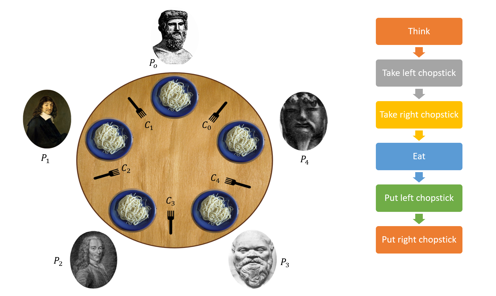

In this problem:
* forks - system resources
* philosophers - competing process

### Deadlock situation at the dinner table:
  - each of the philosophers picked up the left fork
  - sitting and thinking until such time as the right fork is available
  - a philosopher will never release their fork until they have eaten 

### Race condition 
   - race conditions happen when the processes or threads depend on some shared state/resources

###### Example: in a banking application, update account balance on depositing or withdrawing money

### Solution: python synchronization primitives

* Update value in a lock

* Semaphore: Semaphores manage a counter representing the number of _release_ calls minus the number of _acquire_ calls, plus an initial value. The _acquire_ method blocks if necessary until it can return without making the counter negative. If not given, the value defaults to 1.

 
ref: "Learning Concurrency in Python" By Elliot Forbes